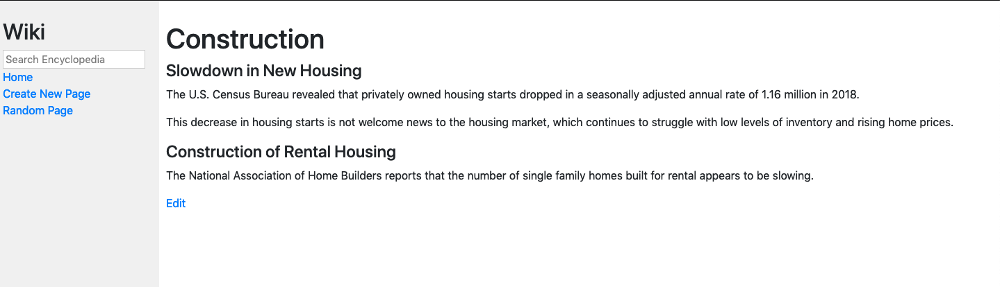

# Wiki-like site

This project is a Wikipedia-like site with the ability to format text using Markdown.

Technology used:

- Python 3.6
- Django 3.0

## Features

- Ability to search existing entires and return a close match page
- Ability to randomly jump to any entry

## Screenshots

## Deployment

Via the terminal navigate to the folder that includes manage.py.

Run:

`python manage.py runserver`

Add a /wiki to the server that is created so that the browser reads:

http://127.0.0.1:8000/wiki/

## Credits

[CS50 Web Programming with Python and Javascript Project](https://cs50.harvard.edu/web/2020/projects/1/wiki/)
